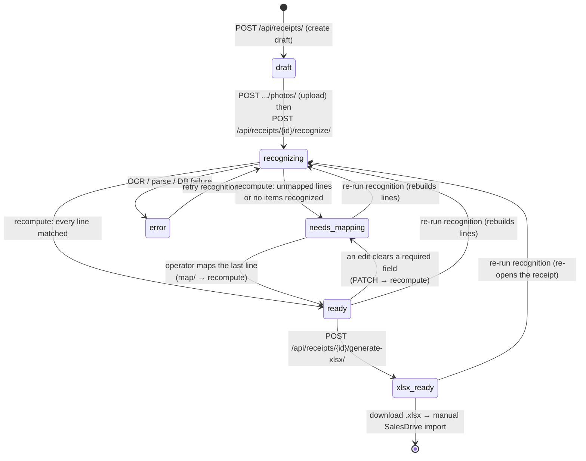
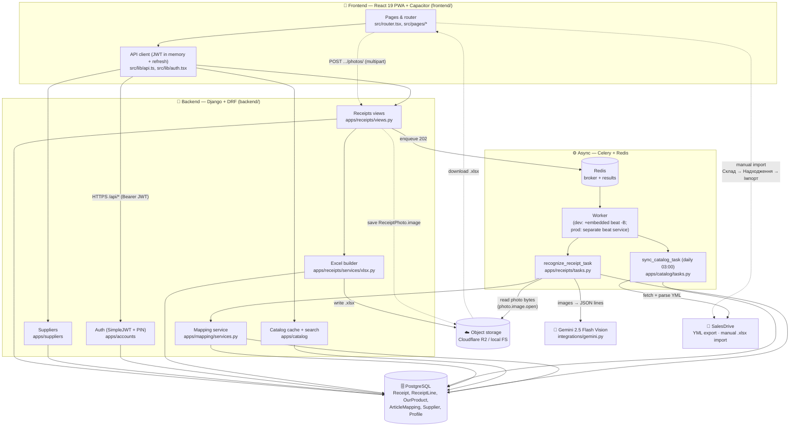

# Valeraup — Architecture

This document describes how Valeraup is put together: the components, the data
flow from a phone photo of a supplier invoice to an `.xlsx` receipt imported into
SalesDrive, and the lifecycle of a `Receipt`. It is written against the **actual**
files in this repository (paths below are real). Pair it with:

- [`docs/INTEGRATIONS.md`](./INTEGRATIONS.md) — SalesDrive YML + Excel import and Gemini specifics.
- [`docs/MAPPING.md`](./MAPPING.md) — the SKU normalization and learning rules.
- [`CLAUDE.md`](../CLAUDE.md) — engineering standards and Definition of Done.

> Spec reference: agreed ТЗ v2.2. The OpenAPI version is pinned to `2.2.0`
> (`SPECTACULAR_SETTINGS.VERSION` in `backend/valeraup/settings.py`).

---

## 1. What Valeraup does (one paragraph)

A manager photographs a printed supplier invoice on a phone (the React 19 PWA in
`frontend/`). The backend (`backend/`) creates a draft `Receipt`, then a Celery
worker sends the photos to **Gemini 2.5 Flash Vision** which extracts line items
(`supplier_sku`, `name`, `quantity`, `price`). Each recognized line is matched
against remembered **supplier-SKU → our-product** mappings (auto if a mapping
exists, manual otherwise — and the manual choice is remembered for next time).
Once every line is matched, the system generates a four-column `.xlsx` receipt
that the manager imports manually into SalesDrive (`Склад → Надходження →
Імпорт`). One warehouse; quantity + purchase price (cost).

---

## 2. Components

### 2.1 Runtime services

**Dev — `docker-compose.yml`** (five lean services):

| Service    | Image / build        | Role |
|------------|----------------------|------|
| `db`       | `postgres:16-alpine` | Single source of truth (PostgreSQL). Volume `pgdata`. |
| `redis`    | `redis:7-alpine`     | Celery broker (DB 0) + result backend (DB 1). |
| `backend`  | `build ./backend`    | Django REST API. Runs `migrate` then `runserver` on `:8000`. |
| `worker`   | `build ./backend`    | Celery worker with **embedded beat** (`celery -A valeraup worker -B`). |
| `frontend` | `node:22-alpine`     | Vite dev server for the PWA on `:5173`. |

**Prod — `docker-compose.prod.yml`** (six services; `db`/`redis` ports closed):

| Service    | Build / command                                  | Role |
|------------|--------------------------------------------------|------|
| `db`       | `postgres:16-alpine`, volume `pgdata`            | PostgreSQL (no published port). |
| `redis`    | `redis:7-alpine`                                 | Celery broker + results (no published port). |
| `backend`  | `build ./backend` → `entrypoint.sh`              | `migrate` → `collectstatic` → `exec gunicorn …:8000 -w 3`. WhiteNoise serves `/static/`. |
| `worker`   | `celery -A valeraup worker -l info`              | Celery worker (**no** `-B`). |
| `beat`     | `celery -A valeraup beat -l info`                | **Dedicated** beat — sole owner of the periodic schedule. |
| `frontend` | `build ./frontend` (multi-stage → nginx, `:80`)  | Serves the built PWA; reverse-proxies `/api`, `/admin`, `/static`, `/media` to `backend`. |

> The dev worker embeds Celery **beat** (`-B`) for convenience. In production it
> runs as its **own** `beat` service so the daily catalog-sync schedule has
> exactly one owner (a scaled worker with `-B` would fire duplicate periodic
> tasks). Volumes `pgdata` and `media` MUST survive redeploys — never `down -v`.

In both stacks `backend` waits on `db` and `redis` healthchecks before booting;
`frontend` depends on `backend`. Config comes from `backend/.env` (dev) /
`.env.prod` (prod) via `env_file`. The dev SPA gets
`VITE_API_BASE_URL=http://localhost:8000/api`; the prod bundle is baked with
`VITE_API_BASE_URL=/api` so the browser talks to a single origin through nginx.

### 2.2 Backend (Django + DRF) — `backend/`

Project package `backend/valeraup/`:

- `settings.py` — env-driven config (`django-environ`): DRF + SimpleJWT, CORS,
  Celery (`CELERY_*` namespace), drf-spectacular (`TITLE="Valeraup API"`,
  `VERSION="2.2.0"`), **R2 object storage** (`STORAGES['default']` → S3 backend
  when all `R2_*` env vars are set, else local `FileSystemStorage`),
  **WhiteNoise** for `/static/` (middleware right after `SecurityMiddleware`;
  `STORAGES['staticfiles']` → `CompressedManifestStaticFilesStorage`), `MEDIA_URL`/
  `MEDIA_ROOT`/`STATIC_ROOT`, and **structured JSON logging**
  (`pythonjsonlogger.jsonlogger.JsonFormatter` on a `json` stream handler;
  `apps`, `integrations`, `celery` loggers at INFO).
- `urls.py` — `/admin/`, `/api/schema/`, `/api/docs/` (Swagger), auth under
  `/api/auth/`, and each app's routes under `/api/`.
- `celery.py` — Celery app reading config from Django settings; autodiscovers
  `tasks.py`; daily beat schedule `sync-salesdrive-catalog-daily` at 03:00.
- `wsgi.py` / `asgi.py` / `__init__.py` (imports `celery_app`).

Five domain apps under `backend/apps/` (AppConfig name `apps.<x>`):

| App | Models (`models.py`) | Responsibility |
|-----|----------------------|----------------|
| `accounts`  | `Profile` (role, `pin_hash`)        | JWT + PIN auth; profile/role. A `post_save` signal (`signals.ensure_profile`) auto-creates a `Profile(role='operator')` per user; `permissions.IsAdmin`/`IsOperatorOrAdmin` gate views on `profile.role`. |
| `suppliers` | `Supplier`                          | Supplier directory. Full CRUD via `SupplierViewSet` (operators list active vendors; only admins mutate). |
| `catalog`   | `OurProduct`, `IntegrationSettings` (singleton) | Local cache of the SalesDrive catalog (mirrored from YML). CLI sync via `manage.py sync_catalog`; admin Settings API for the DB-stored YML URL + test connection. |
| `mapping`   | `ArticleMapping`                    | Remembered supplier-SKU → product links (learning). Admin CRUD via `ArticleMappingViewSet` (`/api/mappings/`). |
| `receipts`  | `Receipt`, `ReceiptPhoto` (`image` + `image_url`), `ReceiptLine` | The receipt workflow, OCR lines, statuses, Excel. Status machine in `services/status.py`. |

Two integration modules under `backend/integrations/`:

- `gemini.py` — the only boundary to Gemini. `SYSTEM_PROMPT` (Ukrainian, strict
  "return ONLY a JSON array" contract) and `recognize_invoice(images, *, model)`,
  which makes the **real `google-genai` call** (`genai.Client(api_key=…)` →
  `types.Part.from_bytes(...)` per page → `client.models.generate_content(...)`;
  the SDK is imported lazily inside the function), then strips Markdown code
  fences, `json.loads`, and **retries once** on a parse error. When
  `GEMINI_API_KEY` is unset **or** there are no images (dev/CI), it logs and
  returns `[]` so the pipeline runs without secrets or network.
- `salesdrive.py` — `fetch_catalog_yml(url)` downloads the YML;
  `parse_catalog_yml(bytes)` walks `shop → offers → offer` into
  `{salesdrive_id, sku, name}` dicts, tolerant of XML namespaces and missing
  fields (SKU priority `vendorCode` > `article` > `param[Артикул]` > offer `id`).

### 2.3 Frontend (React 19 PWA) — `frontend/`

- `src/router.tsx` — routes mirroring the flow `suppliers → camera → table →
  mapping → generate`: `/` Login, `/suppliers`, `/receipt/:id/camera`,
  `/receipt/:id` (recognized lines + inline edit + mapping), `/receipt/:id/generate`,
  `/admin`. Every route except `/` is wrapped in a `RequireAuth` guard; `/admin`
  additionally checks `role === 'admin'` (via `/auth/me/`) and redirects non-admins.
  `/admin` is the «Налаштування» (Settings) hub — `SuppliersPage` shows a gear
  icon linking to it only for admins (a best-effort `authApi.me()` check; the real
  boundary stays server-side).
- `src/App.tsx` — wraps the tree in `ThemeProvider` + `Toaster` + `AuthProvider` +
  the router.
- `src/lib/api.ts` — fetch wrapper holding the JWT **access** token in memory and
  refreshing via `/api/auth/refresh/`; base URL from
  `import.meta.env.VITE_API_BASE_URL`. Exposes typed grouped calls:
  `suppliers.{list,create,update,remove}` (admin CRUD;
  `list({includeInactive})` toggles `?include_inactive=true`),
  `products.search`, `catalog.sync`,
  `settings.{getSalesDrive,saveSalesDrive,testSalesDrive}` (the SalesDrive
  Settings API), `mappings.{list,create,update,remove}` (admin mappings mgmt;
  `list({supplier,q})`), `receipts.{create,get,uploadPhoto,recognize,generateXlsx}`,
  `lines.{patch,map}`, and `authApi.{login,pin,refresh,me,setPin}`. File uploads use
  `api.postForm` (multipart `FormData`, no JSON `Content-Type`).
- `src/lib/auth.tsx` — `AuthProvider` with `login` / `pin` / `logout` (refresh
  token note: Capacitor Secure Storage).
- `src/lib/camera.ts` — `capturePhoto()` dual path: `@capacitor/camera` on native,
  hidden `<input type="file" accept="image/*" capture="environment">` on web;
  returns a `File`.
- `src/lib/useTheme.ts` + `src/components/ThemeProvider.tsx` — light/dark theme:
  sets `data-theme` on `<html>`, persists to `localStorage('valeraup.theme')`,
  defaults from `prefers-color-scheme`; exports `ThemeToggle` (Sun/Moon).
- `src/components/ui/` — the kit: `Button`, `Input`, `Card` (glass surface),
  `Sheet` (Radix Dialog bottom-sheet), `Spinner`, `Skeleton`, `EmptyState`,
  `Toast`/`Toaster`/`useToast`, `StatusBadge` (status via icon + text, not colour
  alone — WCAG); each with a `*.stories.tsx`. `MappingSheet` (debounced
  `products.search` → `lines.map`, optimistic update) builds on `Sheet` and stays
  the receipt-flow mapper. The Settings UI adds two more bottom sheets:
  `SupplierFormSheet` (the add/edit supplier form) and `ProductPickerSheet` (a
  reusable product-search picker adapted from `MappingSheet`, used to re-target a
  mapping).
- `src/styles/tokens.css` — light `:root` tokens + `[data-theme='dark']` overrides
  + `--surface-glass*` / `--glass-*` "Liquid Glass 2026" tokens.
- PWA via `vite-plugin-pwa` (`vite.config.ts`, `public/manifest.webmanifest`),
  Capacitor shell (`capacitor.config.ts`, appId `ua.nextcrm.valeraup`).

---

## 3. Data flow: photo → OCR → mapping → Excel → SalesDrive

The end-to-end path, with the exact endpoints (all non-auth endpoints require
`IsAuthenticated`) and the modules that execute each step.

1. **Authenticate.** The operator logs in with email + password
   (`POST /api/auth/login/`, `EmailTokenObtainPairView`) or a fast 4-digit PIN
   (`POST /api/auth/pin/`, `PinLoginView`, verifies `Profile.pin_hash`). The SPA
   keeps the access token in memory and refreshes via `POST /api/auth/refresh/`.
   `GET /api/auth/me/` returns `{email, role, has_pin}` (the PWA uses `role` to
   gate `/admin` and `has_pin` to offer the PIN flow); a user sets their own PIN
   with `POST /api/auth/set-pin/` (hashed via `make_password`, returns `204`).

2. **Pick a supplier.** `GET /api/suppliers/` lists active suppliers (the
   operator picker). The chosen supplier scopes all subsequent SKU mapping (each
   supplier has its own SKU namespace). Tapping a supplier creates the draft and
   navigates to the camera. Suppliers are managed by admins from the Settings UI
   (see the [admin settings management](#admin-settings-management-supporting-flow)
   flow); the picker only ever shows `is_active=True` rows.

3. **Create draft, then photograph.** `POST /api/receipts/` (`ReceiptCreateView`,
   body `{supplier: id}`) creates a `Receipt` (status `draft`) stamped with
   `created_by`. The PWA then captures one or more pages (`lib/camera.ts`) and
   uploads each via `POST /api/receipts/{id}/photos/` (`ReceiptPhotoUploadView`,
   multipart field `image`). Each upload saves a `ReceiptPhoto` whose `image`
   (`ImageField`) lands in `default_storage` (R2 if configured, else `MEDIA_ROOT`);
   `image_url` is mirrored from `image.url` and returned as `{id, image_url}` so
   the UI shows a thumbnail immediately. (The legacy `photo_urls`-on-create path
   remains for back-compat.)

4. **Recognize (async).** `POST /api/receipts/{id}/recognize/`
   (`ReceiptRecognizeView`) flips the receipt to `recognizing` and enqueues the
   Celery task `recognize_receipt_task` (`backend/apps/receipts/tasks.py`),
   returning **202** immediately. The task:
   - loads each photo's bytes back from storage server-side
     (`_load_photo_bytes` → `photo.image.open('rb')`) — no public URL or outbound
     fetch needed; an unreadable/URL-only photo is skipped with a warning,
   - calls `gemini.recognize_invoice(images)` (returns `[]` when the API key is
     unset or there are no images, so the pipeline is offline-safe),
   - is **idempotent**: it deletes any prior `ReceiptLine` rows inside a
     transaction before recreating them (a redelivered Celery task converges),
   - for each recognized row, parses `quantity`/`price` (tolerating comma decimal
     separators), runs `match_line(supplier_id, supplier_sku)`, stores the raw OCR
     JSON in `ReceiptLine.raw_ocr_json` for audit, and bumps `ArticleMapping.times_used`
     on an auto-match (via an `F()` expression to avoid a read-modify-write race),
   - sets the final status via `recompute_receipt_status` (see §4); any unhandled
     error moves the receipt to `error`.

5. **Map (auto + manual).** Mapping logic lives in
   `backend/apps/mapping/services.py`:
   - `normalize_sku(raw)` — trim, uppercase, collapse internal whitespace
     (punctuation/dashes preserved — see `docs/MAPPING.md`).
   - `match_line(...)` — pure read; returns `(OurProduct, "auto")` on a remembered
     hit, `(None, "unmapped")` on a miss.
   - For unmapped lines, the operator searches the catalog (the `MappingSheet`
     debounces `GET /api/products/search/?q=`, `ProductSearchView`, capped at 20)
     and maps the line: `POST /api/receipts/{id}/lines/{line_id}/map/`
     (`ReceiptLineMapView`) calls `remember_mapping(...)` (idempotent on
     `(supplier, normalized sku)`, increments `times_used`), repoints the line to
     the chosen product, sets `match_status="manual"`, then calls
     `recompute_receipt_status` — so the receipt flips to `ready` as soon as the
     last line is mapped.
   - OCR corrections (quantity / price / sku) go through
     `PATCH /api/receipts/{id}/lines/{line_id}/` (`ReceiptLineUpdateView`), which
     also re-runs `recompute_receipt_status` after saving.

6. **Generate Excel.** `POST /api/receipts/{id}/generate-xlsx/`
   (`ReceiptGenerateXlsxView`) calls `build_receipt_xlsx(receipt)`
   (`backend/apps/receipts/services/xlsx.py`). It builds a single-sheet
   (`Надходження`) workbook with **exactly four columns** —
   `SKU/Артикул`, `Назва`, `Кількість`, `Ціна (собівартість)`. Lines are
   **grouped by `matched_product`** (unmapped lines skipped defensively):
   duplicates of one product merge into one row, **quantities summed** and the
   price set to the **quantity-weighted average** `Σ(qty·price) / Σ(qty)` so total
   receipt cost is preserved (`_weighted_price`; the last/min alternative is the
   open ТЗ §16 question — see `docs/INTEGRATIONS.md`). The bytes are written
   through `default_storage` (`receipts/xlsx/<id>.xlsx`; R2 in prod, filesystem in
   dev); `xlsx_url` is saved on the receipt and the status moves to `xlsx_ready`.

7. **Import into SalesDrive (manual).** The manager downloads the `.xlsx` and
   imports it via `Склад → Надходження → Імпорт`. **There is no direct SalesDrive
   API write** — the import is a deliberate manual step.

### Catalog sync (supporting flow)

`OurProduct` is a local mirror of the SalesDrive catalog so mapping search is fast
and offline-from-source. It is refreshed by `sync_catalog(yml_url)`
(`backend/apps/catalog/services.py`, upsert by `salesdrive_id`), wrapped as the
Celery task `sync_catalog_task` (`backend/apps/catalog/tasks.py`). It runs:

- **on demand** — `POST /api/sync/catalog/` (`CatalogSyncView`, **admin only** via
  `apps.accounts.permissions.IsAdmin` — the product role on `Profile`, not
  Django's `is_staff`), which enqueues the task and returns 202;
- **from the CLI** — `python manage.py sync_catalog [--url …]`, which runs the
  same service synchronously and prints the count (handy for first provisioning,
  cron, or debugging);
- **daily** — Celery beat (`sync-salesdrive-catalog-daily` at 03:00), which calls
  the task with no argument so it resolves the URL from the DB
  (`IntegrationSettings`) and then `settings.SALESDRIVE_YML_URL`.

### Admin settings management (supporting flow)

The `/admin` «Налаштування» page (`frontend/src/pages/AdminPage.tsx`, admin-gated
via `GET /api/auth/me/`) is where an admin configures the system through the
designed PWA instead of Django admin. It has three sections, each backed by
admin-only endpoints (`IsAuthenticated` + `IsAdmin`):

- **SalesDrive** — read/update the DB-stored YML URL and probe it without saving:
  - `GET /api/settings/salesdrive/` → `{salesdrive_yml_url, last_synced, product_count}`
    (`SalesDriveSettingsView.get`, `apps.catalog.views`);
  - `PUT /api/settings/salesdrive/` `{salesdrive_yml_url}` → saves onto the
    `IntegrationSettings` singleton and returns the same read shape;
  - `POST /api/settings/salesdrive/test/` `{salesdrive_yml_url?}` → a non-throwing
    "test connection" probe returning `{ok, product_count, error}` with **HTTP 200**
    even on failure (`probe_catalog_yml` performs no DB write — see
    [`docs/INTEGRATIONS.md` §1.4](./INTEGRATIONS.md#14-db-configurable-yml-url-the-settings-api));
  - the existing `POST /api/sync/catalog/` for the «Синхронізувати» button.

- **Постачальники** — full supplier CRUD via the DRF `DefaultRouter`-mounted
  `SupplierViewSet` (`apps.suppliers`):
  - `GET /api/suppliers/` (operators + admins; `?include_inactive=true` for the
    admin screen so deactivated vendors are visible), `POST /api/suppliers/`
    (admin), `GET/PUT/PATCH/DELETE /api/suppliers/{id}/` (admin). `list`/`retrieve`
    require only `IsAuthenticated`; mutations require `IsAdmin`.
  - `DELETE` returns **409 Conflict** with a Ukrainian
    "deactivate instead" message when the supplier is referenced by a receipt
    (`Receipt.supplier` is `on_delete=PROTECT`), so the audit trail is preserved.

- **Маппінги** — admin management of remembered `ArticleMapping` rows via the
  `DefaultRouter`-mounted `ArticleMappingViewSet` (`apps.mapping`), all admin-only:
  - `GET /api/mappings/` (filters `?supplier=<id>`, `?q=<text>` over supplier SKU /
    product SKU / product name; `select_related` supplier + product; ordered by
    `-times_used`; capped at 200),
  - `POST /api/mappings/` (create / re-target; normalizes the SKU and
    `update_or_create`s on the unique `(supplier, supplier_sku_normalized)` pair;
    **does not** touch `times_used` — admin curation is not a "use"),
  - `PATCH /api/mappings/{id}/` (re-target the product and/or re-normalize the SKU;
    a colliding SKU surfaces as a clean 409),
  - `DELETE /api/mappings/{id}/` (forget the auto-match; never cascades into
    receipts, which reference the product directly).

  This is distinct from the receipt-flow line-map action
  `POST /api/receipts/{id}/lines/{line_id}/map/` (which calls `remember_mapping`
  and **does** bump `times_used`); the admin API is curation of the "memory",
  independent of any receipt.

---

## 4. Receipt status lifecycle

`Receipt.status` (choices in `backend/apps/receipts/models.py`) drives the UI and
the pipeline. The set is:

| Status          | Label (uk)              | Meaning |
|-----------------|-------------------------|---------|
| `draft`         | Чернетка                | Created with photos; not yet recognized. **(default)** |
| `recognizing`   | Розпізнається           | OCR task running. |
| `needs_mapping` | Потрібен маппінг        | OCR done but ≥1 line is unmapped (or no items recognized). |
| `ready`         | Готовий до генерації    | Every line is matched; Excel can be generated. |
| `xlsx_ready`    | Excel згенеровано       | `.xlsx` built and `xlsx_url` set. |
| `error`         | Помилка                 | OCR/parse/DB failure; UI can offer a retry. |

The two operations that move the status live in
`backend/apps/receipts/services/status.py`:

- **`set_receipt_status(receipt, status)`** — an *explicit* transition, validated
  against an allow-list and logged (`error` is reachable from any state). Used by
  the views (e.g. → `recognizing`, → `xlsx_ready`).
- **`recompute_receipt_status(receipt)`** — derives the *data-driven* status from
  the current lines and **never auto-downgrades** a terminal/explicit state
  (`xlsx_ready` / `error`). The same helper is used by the OCR task and the
  map/patch views, so "is this receipt ready?" has exactly one definition.

Transition rules, exactly as coded:

- `POST .../recognize/` sets `recognizing` (in the view) then enqueues the task,
  which also sets `recognizing` at its start (idempotent re-entry).
- In `recognize_receipt_task`, after OCR + auto-match, `recompute_receipt_status`
  resolves the status:
  - **no items recognized** → `needs_mapping` (needs review, not a hard error),
  - **any line unmapped** → `needs_mapping`,
  - **all lines matched** → `ready`,
  - **any unhandled exception** → `error`.
- Manual mapping (`.../lines/{id}/map/`) and line edits (`PATCH .../lines/{id}/`)
  **both call `recompute_receipt_status` after saving**, so the receipt
  auto-promotes `needs_mapping → ready` the moment the last line is mapped (and
  drops back to `needs_mapping` if an edit clears a required field). This is wired
  now — it is no longer a future enhancement.
- `POST .../generate-xlsx/` sets `xlsx_ready` and records `xlsx_url`.
- Re-running recognition (`xlsx_ready`/`needs_mapping`/`ready`/`error` →
  `recognizing`) is safe: the task rebuilds lines from scratch.

> The `needs_mapping ⇄ ready` edges are wired: every `map/` and line `PATCH` calls
> `recompute_receipt_status`, which re-derives the status from the current lines
> (without ever auto-downgrading a terminal `xlsx_ready` / `error`).

---

## 5. System architecture diagram

---

## 6. Key design decisions (the WHY)

- **OCR runs off the request cycle.** Gemini Vision calls take seconds.
  `recognize` returns 202 and a Celery worker does the work, so the API stays
  responsive on mobile networks.
- **Idempotency everywhere.** `recognize_receipt_task` deletes prior lines before
  recreating them; `remember_mapping` and `sync_catalog` upsert. Celery may
  redeliver tasks, so each must converge, not compound.
- **Mapping is "map once, remember forever."** A manual map writes an
  `ArticleMapping` keyed on `(supplier, normalized sku)`; future invoices from the
  same supplier auto-match. `times_used` records how often each mapping is relied
  on. Normalization (trim/upper/collapse spaces) prevents cosmetic OCR variance
  from creating duplicate mappings. See `docs/MAPPING.md`.
- **No direct SalesDrive write.** SalesDrive offers a YML read export (for the
  catalog) but the receipt goes back in via a **manual** Excel import. The Excel
  format is exactly four columns; lines are grouped by product (summed quantity,
  quantity-weighted price — ТЗ §16 open question); the headers/order are
  centralized constants and flagged for verification against the live template.
- **One status rule, one home.** `recompute_receipt_status` /
  `set_receipt_status` live in `services/status.py` so the OCR task, the map
  endpoint, and line edits all agree on what `ready` means and never auto-downgrade
  a terminal `xlsx_ready` / `error`.
- **Storage is env-gated.** With `R2_*` set, files live in Cloudflare R2 (S3
  backend); otherwise the local filesystem — so dev/CI run with zero cloud setup.
  Uploaded photos are read **back** server-side for OCR, so a private bucket works.
- **Secrets are optional in dev.** Without `GEMINI_API_KEY` (or with no images)
  the OCR call returns `[]` and the pipeline still runs end-to-end; without `R2_*`
  storage falls back to disk. The whole system is runnable and testable without
  credentials — `recognize_invoice` imports the `google-genai` SDK lazily so the
  module never fails to import when the package/key is absent.
- **Structured JSON logs at every key step.** OCR request/result, mapping
  match/remember, catalog sync, Excel build, photo upload, and status changes all
  emit JSON records with `receipt_id` / `supplier_id` / counts, so the pipeline is
  auditable off-host. Secrets and raw PINs are never logged.

---

## 7. Production deploy (`docker-compose.prod.yml`)

The prod stack is the deploy-for-real counterpart to the dev compose (see §2.1
for the service table). Key differences and the WHY:

- **`backend/entrypoint.sh`** is the image's default `CMD`: `migrate --noinput` →
  `collectstatic --noinput` → `exec gunicorn valeraup.wsgi:application -b
  0.0.0.0:8000 -w 3 --timeout 60`. `exec` hands PID 1 to gunicorn so `docker stop`
  reaches the server directly. The dev compose overrides `command:` with
  `runserver`, so dev keeps live reload and skips collectstatic.
- **WhiteNoise** serves the collected Django static (`/static/` — admin CSS,
  Swagger UI) in-process, so no separate static web server is needed. Middleware
  sits right after `SecurityMiddleware`; `STORAGES['staticfiles']` is the
  compressed-manifest backend.
- **Beat is split out** into its own `beat` service (the dev worker's `-B` would
  fire duplicate periodic tasks if the worker were scaled).
- **frontend** is a multi-stage nginx image on `:80` that reverse-proxies `/api`,
  `/admin`, `/static`, and `/media` to `backend:8000`, so the PWA, REST API, and
  uploaded media share one origin (no browser CORS, simpler TLS termination).
- **Media** durable on R2 when `R2_*` is set (served by R2 URLs); otherwise the
  `media` named volume served via the nginx `/media/` proxy.
- Everything `restart: unless-stopped` with healthchecks and
  `depends_on: service_healthy`. **Never `down -v`** — `pgdata` and `media` must
  persist. Config comes from `.env.prod` (copy `.env.prod.example`, never commit).

> **Migrations caveat:** migration files are **not committed** (only
> `migrations/__init__.py`), and `entrypoint.sh` runs only `migrate`. A fresh prod
> deploy must generate migrations once (`makemigrations`) before the schema
> exists. See the README "⚠️ Прод-міграції" note.
