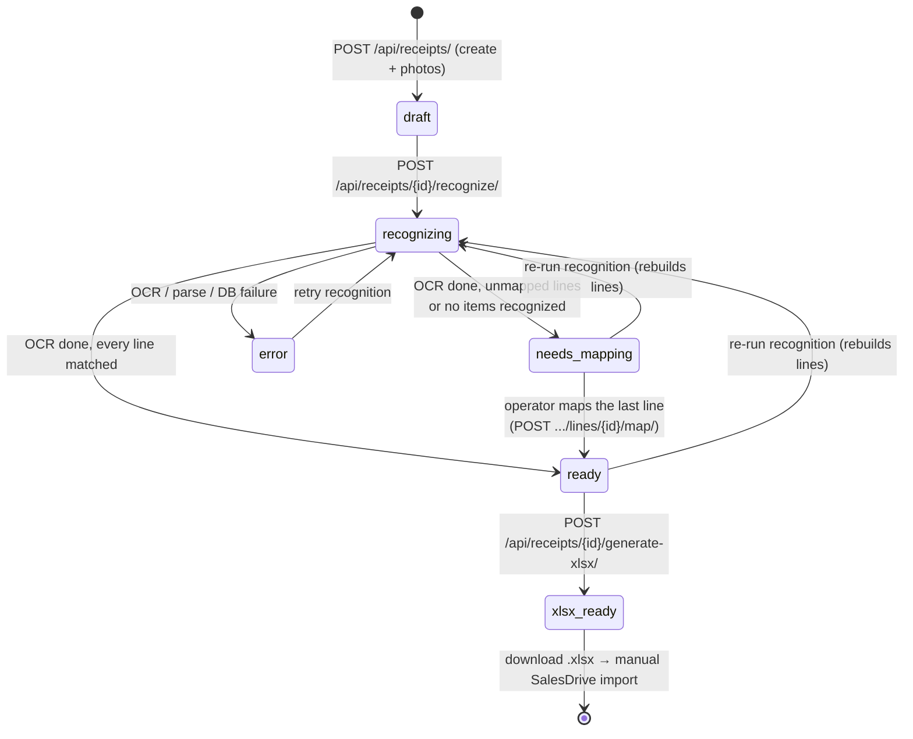
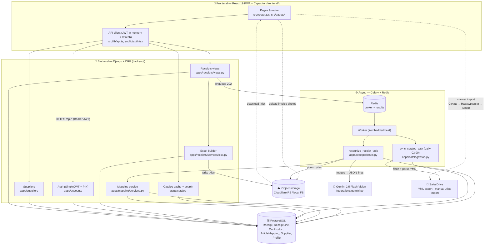

# Valeraup — Architecture

This document describes how Valeraup is put together: the components, the data
flow from a phone photo of a supplier invoice to an `.xlsx` receipt imported into
SalesDrive, and the lifecycle of a `Receipt`. It is written against the **actual**
files in this repository (paths below are real). Pair it with:

- [`docs/INTEGRATIONS.md`](./INTEGRATIONS.md) — SalesDrive YML + Excel import and Gemini specifics.
- [`docs/MAPPING.md`](./MAPPING.md) — the SKU normalization and learning rules.
- [`CLAUDE.md`](../CLAUDE.md) — engineering standards and Definition of Done.

> Spec reference: agreed ТЗ v2.2. The OpenAPI version is pinned to `2.2.0`
> (`SPECTACULAR_SETTINGS.VERSION` in `backend/valeraup/settings.py`).

---

## 1. What Valeraup does (one paragraph)

A manager photographs a printed supplier invoice on a phone (the React 19 PWA in
`frontend/`). The backend (`backend/`) creates a draft `Receipt`, then a Celery
worker sends the photos to **Gemini 2.5 Flash Vision** which extracts line items
(`supplier_sku`, `name`, `quantity`, `price`). Each recognized line is matched
against remembered **supplier-SKU → our-product** mappings (auto if a mapping
exists, manual otherwise — and the manual choice is remembered for next time).
Once every line is matched, the system generates a four-column `.xlsx` receipt
that the manager imports manually into SalesDrive (`Склад → Надходження →
Імпорт`). One warehouse; quantity + purchase price (cost).

---

## 2. Components

### 2.1 Runtime services (`docker-compose.yml`)

Five lean services:

| Service    | Image / build        | Role |
|------------|----------------------|------|
| `db`       | `postgres:16-alpine` | Single source of truth (PostgreSQL). Volume `pgdata`. |
| `redis`    | `redis:7-alpine`     | Celery broker (DB 0) + result backend (DB 1). |
| `backend`  | `build ./backend`    | Django REST API. Runs `migrate` then `runserver`/`gunicorn` on `:8000`. |
| `worker`   | `build ./backend`    | Celery worker with **embedded beat** (`celery -A valeraup worker -B`). |
| `frontend` | `node:22-alpine`     | Vite dev server for the PWA on `:5173`. |

> The worker embeds Celery **beat** (`-B`) for dev convenience only. In
> production, beat MUST run as its own process so the daily catalog-sync schedule
> is owned by exactly one process — this is called out in `docker-compose.yml`.

The `backend` waits on `db` and `redis` healthchecks before booting; `frontend`
depends on `backend`. Config for `backend`/`worker` comes from `backend/.env`
(`env_file`); the SPA gets `VITE_API_BASE_URL=http://localhost:8000/api`.

### 2.2 Backend (Django + DRF) — `backend/`

Project package `backend/valeraup/`:

- `settings.py` — env-driven config (`django-environ`): DRF + SimpleJWT, CORS,
  Celery (`CELERY_*` namespace), drf-spectacular (`TITLE="Valeraup API"`,
  `VERSION="2.2.0"`), **R2 object storage** (S3 backend when all `R2_*` env vars
  are set, else local `FileSystemStorage`), and **structured JSON logging**
  (`pythonjsonlogger.jsonlogger.JsonFormatter` on a `json` stream handler;
  `apps`, `integrations`, `celery` loggers at INFO).
- `urls.py` — `/admin/`, `/api/schema/`, `/api/docs/` (Swagger), auth under
  `/api/auth/`, and each app's routes under `/api/`.
- `celery.py` — Celery app reading config from Django settings; autodiscovers
  `tasks.py`; daily beat schedule `sync-salesdrive-catalog-daily` at 03:00.
- `wsgi.py` / `asgi.py` / `__init__.py` (imports `celery_app`).

Five domain apps under `backend/apps/` (AppConfig name `apps.<x>`):

| App | Models (`models.py`) | Responsibility |
|-----|----------------------|----------------|
| `accounts`  | `Profile` (role, `pin_hash`)        | JWT + PIN auth; profile/role. |
| `suppliers` | `Supplier`                          | Supplier directory. |
| `catalog`   | `OurProduct`                        | Local cache of the SalesDrive catalog (mirrored from YML). |
| `mapping`   | `ArticleMapping`                    | Remembered supplier-SKU → product links (learning). |
| `receipts`  | `Receipt`, `ReceiptPhoto`, `ReceiptLine` | The receipt workflow, OCR lines, statuses, Excel. |

Two integration modules under `backend/integrations/`:

- `gemini.py` — the only boundary to Gemini. `SYSTEM_PROMPT` (Ukrainian, strict
  "return ONLY a JSON array" contract) and `recognize_invoice(images, *, model)`
  which strips Markdown code fences, `json.loads`, and **retries once** on a parse
  error. When `GEMINI_API_KEY` is unset (dev/CI) it logs and returns `[]` so the
  pipeline runs without secrets.
- `salesdrive.py` — `fetch_catalog_yml(url)` downloads the YML; `parse_catalog_yml(bytes)`
  walks `shop → offers → offer` into `{salesdrive_id, sku, name}` dicts.

### 2.3 Frontend (React 19 PWA) — `frontend/`

- `src/router.tsx` — routes: `/` Login, `/suppliers`, `/receipt/new` (camera),
  `/receipt/:id` (mapping table), `/receipt/:id/generate`, `/admin`. Every route
  except `/` is wrapped in a `RequireAuth` guard.
- `src/lib/api.ts` — fetch wrapper holding the JWT **access** token in memory and
  refreshing via `/api/auth/refresh/`; base URL from `import.meta.env.VITE_API_BASE_URL`.
- `src/lib/auth.tsx` — `AuthProvider` with `login` / `pin` / `logout` (refresh
  token note: Capacitor Secure Storage).
- `src/components/ui/` — `Button` (CVA + Radix Slot), `StatusBadge` (status via
  icon + text, not colour alone — WCAG); `MappingSheet` bottom sheet for manual
  mapping; page stubs under `src/pages/`.
- PWA via `vite-plugin-pwa` (`vite.config.ts`, `public/manifest.webmanifest`),
  Capacitor shell (`capacitor.config.ts`, appId `ua.nextcrm.valeraup`).

---

## 3. Data flow: photo → OCR → mapping → Excel → SalesDrive

The end-to-end path, with the exact endpoints (all non-auth endpoints require
`IsAuthenticated`) and the modules that execute each step.

1. **Authenticate.** The operator logs in with email + password
   (`POST /api/auth/login/`, `EmailTokenObtainPairView`) or a fast 4-digit PIN
   (`POST /api/auth/pin/`, `PinLoginView`, verifies `Profile.pin_hash`). The SPA
   keeps the access token in memory and refreshes via `POST /api/auth/refresh/`.

2. **Pick a supplier.** `GET /api/suppliers/` lists active suppliers. The chosen
   supplier scopes all subsequent SKU mapping (each supplier has its own SKU
   namespace).

3. **Photograph the invoice.** The PWA captures one or more pages (Capacitor
   Camera) and uploads them to storage. It then **creates a draft**:
   `POST /api/receipts/` (`ReceiptCreateView`) creates a `Receipt`
   (status `draft`) plus `ReceiptPhoto` rows holding the image URLs, stamped with
   `created_by`.

4. **Recognize (async).** `POST /api/receipts/{id}/recognize/`
   (`ReceiptRecognizeView`) flips the receipt to `recognizing` and enqueues the
   Celery task `recognize_receipt_task` (`backend/apps/receipts/tasks.py`),
   returning **202** immediately. The task:
   - loads the photo bytes (`_load_photo_bytes` — the storage fetch is the wired
     integration point; until storage access is finalized it returns `[]`, so
     OCR short-circuits cleanly),
   - calls `gemini.recognize_invoice(images)`,
   - is **idempotent**: it deletes any prior `ReceiptLine` rows before recreating
     them (a redelivered Celery task converges instead of duplicating),
   - for each recognized row, parses `quantity`/`price` (tolerating comma decimal
     separators), runs `match_line(supplier_id, supplier_sku)`, stores the raw OCR
     JSON in `ReceiptLine.raw_ocr_json` for audit, and bumps `ArticleMapping.times_used`
     on an auto-match (via an `F()` expression to avoid a read-modify-write race),
   - sets the final status (see §4).

5. **Map (auto + manual).** Mapping logic lives in
   `backend/apps/mapping/services.py`:
   - `normalize_sku(raw)` — trim, uppercase, collapse internal whitespace
     (punctuation/dashes preserved — see `docs/MAPPING.md`).
   - `match_line(...)` — pure read; returns `(OurProduct, "auto")` on a remembered
     hit, `(None, "unmapped")` on a miss.
   - For unmapped lines, the operator searches the catalog
     (`GET /api/products/search/?q=`, `ProductSearchView`, capped at 20 results)
     and maps the line: `POST /api/receipts/{id}/lines/{line_id}/map/`
     (`ReceiptLineMapView`) calls `remember_mapping(...)` (idempotent on
     `(supplier, normalized sku)`, increments `times_used`), repoints the line to
     the chosen product and sets `match_status="manual"`.
   - OCR corrections (quantity / price / sku) go through
     `PATCH /api/receipts/{id}/lines/{line_id}/` (`ReceiptLineUpdateView`).

6. **Generate Excel.** `POST /api/receipts/{id}/generate-xlsx/`
   (`ReceiptGenerateXlsxView`) calls `build_receipt_xlsx(receipt)`
   (`backend/apps/receipts/services/xlsx.py`). It builds a single-sheet
   (`Надходження`) workbook with **exactly four columns** —
   `SKU/Артикул`, `Назва`, `Кількість`, `Ціна (собівартість)` — sourced from
   `matched_product.sku`, `matched_product.name`, `line.quantity`, `line.price`.
   Unmapped lines (no `matched_product`) are skipped defensively. The bytes are
   written through Django's default storage (R2 in prod, filesystem in dev); the
   `xlsx_url` is saved on the receipt and the status moves to `xlsx_ready`. The
   header strings/order are centralized constants and must be verified against the
   live SalesDrive import template (`docs/INTEGRATIONS.md`).

7. **Import into SalesDrive (manual).** The manager downloads the `.xlsx` and
   imports it via `Склад → Надходження → Імпорт`. **There is no direct SalesDrive
   API write** — the import is a deliberate manual step.

### Catalog sync (supporting flow)

`OurProduct` is a local mirror of the SalesDrive catalog so mapping search is fast
and offline-from-source. It is refreshed by `sync_catalog(yml_url)`
(`backend/apps/catalog/services.py`, upsert by `salesdrive_id`), wrapped as the
Celery task `sync_catalog_task` (`backend/apps/catalog/tasks.py`). It runs:

- **on demand** — `POST /api/sync/catalog/` (`CatalogSyncView`, **admin only**,
  `IsAdminUser`), which enqueues the task and returns 202;
- **daily** — Celery beat (`sync-salesdrive-catalog-daily` at 03:00), which calls
  the task with no argument so it falls back to `settings.SALESDRIVE_YML_URL`.

---

## 4. Receipt status lifecycle

`Receipt.status` (choices in `backend/apps/receipts/models.py`) drives the UI and
the pipeline. The set is:

| Status          | Label (uk)              | Meaning |
|-----------------|-------------------------|---------|
| `draft`         | Чернетка                | Created with photos; not yet recognized. **(default)** |
| `recognizing`   | Розпізнається           | OCR task running. |
| `needs_mapping` | Потрібен маппінг        | OCR done but ≥1 line is unmapped (or no items recognized). |
| `ready`         | Готовий до генерації    | Every line is matched; Excel can be generated. |
| `xlsx_ready`    | Excel згенеровано       | `.xlsx` built and `xlsx_url` set. |
| `error`         | Помилка                 | OCR/parse/DB failure; UI can offer a retry. |

Transition rules, exactly as coded:

- `POST .../recognize/` sets `recognizing` (in the view) then enqueues the task,
  which also sets `recognizing` at its start (idempotent re-entry).
- In `recognize_receipt_task`, after OCR + auto-match:
  - **no items recognized** → `needs_mapping` (treated as needing review, not a
    hard error),
  - **any line unmapped** → `needs_mapping`,
  - **all lines matched** → `ready`,
  - **any unhandled exception** → `error`.
- Manual mapping (`.../lines/{id}/map/`) and line edits (`PATCH .../lines/{id}/`)
  do not themselves change the receipt status in the current skeleton; the
  operator re-checks readiness in the UI (a future enhancement may auto-promote
  `needs_mapping → ready` once the last line is mapped).
- `POST .../generate-xlsx/` sets `xlsx_ready` and records `xlsx_url`.
- Re-running recognition (`recognizing → …`) is safe: the task rebuilds lines
  from scratch.

> Note: the `needs_mapping → ready` and `xlsx_ready` terminal edge reflect the
> intended operator workflow; status promotion on the last manual map is a planned
> UI/server enhancement (the map endpoint currently sets the line's
> `match_status` but not the receipt status).

---

## 5. System architecture diagram

---

## 6. Key design decisions (the WHY)

- **OCR runs off the request cycle.** Gemini Vision calls take seconds.
  `recognize` returns 202 and a Celery worker does the work, so the API stays
  responsive on mobile networks.
- **Idempotency everywhere.** `recognize_receipt_task` deletes prior lines before
  recreating them; `remember_mapping` and `sync_catalog` upsert. Celery may
  redeliver tasks, so each must converge, not compound.
- **Mapping is "map once, remember forever."** A manual map writes an
  `ArticleMapping` keyed on `(supplier, normalized sku)`; future invoices from the
  same supplier auto-match. `times_used` records how often each mapping is relied
  on. Normalization (trim/upper/collapse spaces) prevents cosmetic OCR variance
  from creating duplicate mappings. See `docs/MAPPING.md`.
- **No direct SalesDrive write.** SalesDrive offers a YML read export (for the
  catalog) but the receipt goes back in via a **manual** Excel import. The Excel
  format is exactly four columns; the headers/order are centralized constants and
  flagged for verification against the live template.
- **Storage is env-gated.** With `R2_*` set, files live in Cloudflare R2 (S3
  backend); otherwise the local filesystem — so dev/CI run with zero cloud setup.
- **Secrets are optional in dev.** Without `GEMINI_API_KEY` the OCR call returns
  `[]` and the pipeline still runs end-to-end; without `R2_*` storage falls back
  to disk. This keeps the whole system runnable and testable without credentials.
- **Structured JSON logs at every key step.** OCR request/result, mapping
  match/remember, catalog sync, and Excel build all emit JSON records with
  `receipt_id` / `supplier_id` / counts, so the pipeline is auditable off-host.
