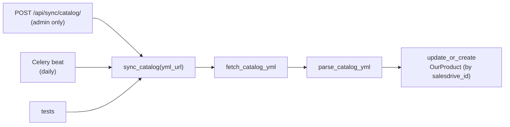
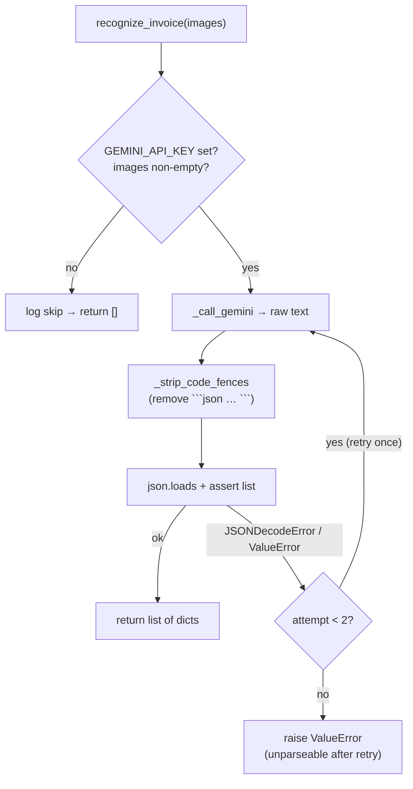

# Integrations

Valeraup has exactly two external integrations:

1. **SalesDrive** — the source of our product catalog (read) and the destination
   for purchase receipts (write, via a manually imported `.xlsx` file).
2. **Google Gemini 2.5 Flash Vision** — OCR that turns photographed supplier
   invoices into structured line items.

Both integrations are isolated behind the `backend/integrations/` package so the
rest of the app never talks to a third party directly. This document is the
single reference for how those boundaries work and — crucially — which parts must
be **verified against the live SalesDrive UI before production use**.

| Code | Purpose |
| --- | --- |
| [`backend/integrations/salesdrive.py`](../backend/integrations/salesdrive.py) | Fetch + parse SalesDrive YML catalog |
| [`backend/apps/catalog/services.py`](../backend/apps/catalog/services.py) | Upsert parsed offers into `OurProduct` |
| [`backend/apps/receipts/services/xlsx.py`](../backend/apps/receipts/services/xlsx.py) | Build the receipt `.xlsx` for SalesDrive import |
| [`backend/integrations/gemini.py`](../backend/integrations/gemini.py) | Gemini Vision OCR of invoice photos |

---

## 1. SalesDrive

SalesDrive is the ERP/CRM of record. Valeraup interacts with it in **two
directions**, neither of which uses a direct REST API:

- **Catalog in (read):** SalesDrive exports the full product catalog as a YML
  "shop" file (the Yandex Market XML dialect). Valeraup downloads and mirrors it.
- **Receipt out (write):** Valeraup generates an `.xlsx` file that a manager
  **manually** imports into SalesDrive. There is intentionally no programmatic
  write path — see [§1.4](#14-receipt-import-manual-step).

### 1.1 YML catalog export

The catalog URL is configured once via the `SALESDRIVE_YML_URL` env var. To
obtain it in the SalesDrive admin:

> **Установки → Товари/Послуги → Експорт YML**

That screen produces a stable, fully-qualified URL to a generated YML file. Put
it in `backend/.env`:

```dotenv
SALESDRIVE_YML_URL=https://example.salesdrive.ua/export/yml/
```

**Fetch.** `integrations.salesdrive.fetch_catalog_yml(yml_url)` performs a plain
`requests.get` with a split timeout — a short connect timeout to fail fast on a
dead host, and a generous read timeout because the export can be large:

```python
_HTTP_TIMEOUT: tuple[int, int] = (10, 120)  # (connect, read) seconds
```

It raises `ValueError` if the URL is empty and propagates
`requests.HTTPError` / `requests.RequestException` on transport failures, and
logs `salesdrive_fetch_request` / `salesdrive_fetch_result` (with byte count).

### 1.2 YML structure and parsing

The YML follows the standard shop structure. Valeraup only cares about the
offers:

```xml
<yml_catalog date="2026-05-30 12:00">
  <shop>
    <name>Our Shop</name>
    <offers>
      <offer id="12345" available="true">
        <name>Гель-лак Kodi 8ml, рожевий</name>
        <vendorCode>KODI-8-PINK</vendorCode>
        <price>180</price>
        <param name="Артикул">KODI-8-PINK</param>
      </offer>
      ...
    </offers>
  </shop>
</yml_catalog>
```

`integrations.salesdrive.parse_catalog_yml(yml_bytes)` walks
`yml_catalog → shop → offers → offer` (using a tolerant `.//offer` search so it
works regardless of wrapper depth) and returns a list of plain dicts:

```python
[{"salesdrive_id": "12345", "sku": "KODI-8-PINK", "name": "Гель-лак Kodi 8ml, рожевий"}, ...]
```

**Keying.** Each offer's `id` attribute becomes `salesdrive_id` — SalesDrive's
stable identifier, which is `unique` on `OurProduct`. Offers **without** an `id`
are skipped (an offer we cannot deterministically key on is useless as an upsert
target) and counted in the `skipped` log field.

**SKU resolution.** SalesDrive has no single canonical SKU tag across exports, so
`_offer_sku()` looks in priority order and uses the **first non-empty** value:

1. `<vendorCode>`
2. `<article>`
3. `<param name="Артикул">` / `name="SKU"` / `name="vendorCode"` (case-insensitive)
4. the `offer` `id` attribute (last-resort fallback)

> **VERIFY before production:** confirm which of these tags your specific
> SalesDrive export actually populates with the SKU that matches what suppliers
> print on their invoices. The mapping logic ([docs/MAPPING.md](./MAPPING.md))
> joins on this `sku`, so picking the wrong tag silently breaks auto-matching.

**Errors.** `parse_catalog_yml` raises `ValueError` if the bytes are not
well-formed XML, or if there are no `<offer>` elements at all. Parsing uses the
stdlib `xml.etree.ElementTree`, which does **not** resolve external entities by
default — sufficient hardening for a trusted account export.

### 1.3 Upsert into the local cache

`integrations.salesdrive` stays free of Django ORM concerns. The upsert lives in
`apps.catalog.services.sync_catalog(yml_url)`:

- Falls back to `settings.SALESDRIVE_YML_URL` when called with a falsy URL.
- Wraps all writes in a single `transaction.atomic()` so a sync that fails
  halfway never leaves the cache torn / half-updated.
- Upserts each offer with `OurProduct.objects.update_or_create(salesdrive_id=…)`
  — **idempotent**: a re-sync updates `sku`/`name` in place instead of creating
  duplicates. Running it repeatedly converges the cache to whatever the YML
  currently contains.
- Returns the number of products synced and logs `catalog_sync_start` /
  `catalog_sync_done` (with `synced` / `created` / `updated` counts).

It is invoked from three places without duplicating logic:



### 1.4 Receipt import (manual step)

There is **no direct API write** to SalesDrive. The manager imports the generated
`.xlsx` by hand:

> **Склад → Надходження → Імпорт**

This is a deliberate product decision: SalesDrive's receipt import gives the
manager a final human review of cost and quantity before stock and weighted-
average cost are mutated. Valeraup's job ends at producing a correct file.

#### The four-column format

`apps.receipts.services.xlsx.build_receipt_xlsx(receipt)` produces a single-sheet
workbook (sheet title `Надходження`) with a header row plus one row per **matched**
line:

| Column header (`COLUMN_HEADERS`) | Source field |
| --- | --- |
| `SKU/Артикул` | `line.matched_product.sku` |
| `Назва` | `line.matched_product.name` |
| `Кількість` | `line.quantity` (Decimal, 3 dp) |
| `Ціна (собівартість)` | `line.price` — purchase cost, Decimal, 2 dp |

Implementation notes:

- **Only matched lines are written.** A line with no `matched_product` has no
  SalesDrive SKU to import against, so it is skipped and counted in `rows_skipped`.
  In normal flow this never triggers, because the receipt only reaches `ready`
  once every line is mapped — the skip is defensive.
- `Decimal` values are written **as-is**; openpyxl serializes them to exact
  numeric cells, preserving quantity (3 dp) and price (2 dp) precision with no
  float rounding.
- The function logs `receipt_xlsx_built` with `rows_written`, `rows_skipped` and
  byte size. It returns `bytes`, ready to upload to R2 or stream as a download.

> **VERIFY before production:** the exact header strings, their order, the sheet
> title, and whether SalesDrive's importer expects an inclusive-of-VAT or
> net cost in the price column **must be checked against the live SalesDrive
> import template**. All of these are centralized as the module constants
> `SHEET_TITLE` and `COLUMN_HEADERS`, so adjusting them is a one-line change.

#### Weighted-average cost example

SalesDrive maintains stock cost as a **weighted average**. The `Ціна
(собівартість)` we send is the per-unit **purchase price** of this receipt's
goods; SalesDrive blends it with existing stock on import. Worked example:

- Existing stock: **10 units** at an average cost of **₴100** → inventory value
  **₴1 000**.
- This receipt (our `.xlsx`): **5 units** at **₴130** → added value **₴650**.
- After import:
  - total units = 10 + 5 = **15**
  - total value = 1 000 + 650 = **₴1 650**
  - new weighted-average cost = 1 650 / 15 = **₴110.00**

So Valeraup is responsible only for reporting the **honest purchase price and
quantity per SKU**; SalesDrive does the averaging. This is why the `price` column
is the *cost* of the goods in this delivery, not a sale price.

---

## 2. Gemini 2.5 Flash Vision (OCR)

`integrations.gemini` is the single boundary between Valeraup and Google's Gemini
API. It sends one or more photographed pages of **a single supplier invoice** to
the `gemini-2.5-flash` model (via the `google-genai` SDK) and returns structured
line-item dicts.

Configuration:

```dotenv
GEMINI_API_KEY=your-gemini-key
GEMINI_MODEL=gemini-2.5-flash
```

### 2.1 System prompt

The agreed prompt (`gemini.SYSTEM_PROMPT`, in Ukrainian) is intentionally terse
and imperative — the model follows short, unambiguous output-shape instructions
far more reliably than long descriptive ones. It instructs the model to:

- Extract **all** product line items across the supplied page(s).
- Return **only** a valid JSON array of objects — no prose, no Markdown, nothing
  before or after the array.
- Use **exactly** these four fields per object (the contract consumed by
  `recognize_receipt_task`):

  | Field | Meaning | Type |
  | --- | --- | --- |
  | `supplier_sku` | supplier's article / product code | string |
  | `name` | product name | string |
  | `quantity` | quantity | number |
  | `price` | unit price / cost | number |

- Put `null` for any value not present on the invoice (so downstream code can
  tell "OCR could not read it" apart from "value is 0").
- **Never invent** values not visible on the photo.
- Return an empty array `[]` if there are no line items.

### 2.2 JSON response handling: fence-strip + retry

LLMs frequently wrap JSON in Markdown code fences even when told not to. Parsing
must never depend on the model obeying the prompt, so the response is handled
defensively:



Step by step (`recognize_invoice(images, *, model=None)`):

1. **Skip guards.** If `images` is empty, or `settings.GEMINI_API_KEY` is unset
   (local/dev/CI without a key), it logs `gemini_recognize_skip` and returns `[]`
   — the pipeline and test suite run with no network access or secrets.
2. **Call.** `_call_gemini()` builds a multimodal request: the system prompt
   followed by each page as an inline `image/jpeg` part, then
   `client.models.generate_content(...)`. It raises `RuntimeError` if the
   `google-genai` SDK is not installed.
3. **Fence strip.** `_strip_code_fences()` removes a leading/trailing
   ```` ```json ``` ```` (or bare ```` ``` ````) fence and trims whitespace.
4. **Parse.** `json.loads`, then assert the result is a `list`; non-dict
   elements are filtered out so one stray element cannot poison the batch.
5. **Retry once.** On `JSONDecodeError` / `ValueError`, the call is retried
   **exactly once** (two attempts total) — transient LLM JSON glitches usually
   recover on a re-ask, and capping at one retry bounds cost and latency.
6. **Give up cleanly.** If both attempts fail, it logs `gemini_recognize_failed`
   and raises `ValueError("Gemini returned an unparseable response after one
   retry")`.

A successful response looks like:

```json
[
  {"supplier_sku": "ABC-123", "name": "Гель-лак рожевий 8ml", "quantity": 12, "price": 95.50},
  {"supplier_sku": "ABC-777", "name": "Базове покриття 15ml", "quantity": 3,  "price": null}
]
```

### 2.3 Structured logging and `raw_ocr_json` audit

Every key step emits a structured JSON log line via `logging.getLogger(__name__)`,
so OCR cost and quality can be audited off-host:

| Event | When |
| --- | --- |
| `gemini_recognize_skip` | no images / no API key |
| `gemini_recognize_request` | request sent (model, image count) |
| `gemini_recognize_result` | success (line count, attempt number) |
| `gemini_recognize_parse_error` | a parse attempt failed |
| `gemini_recognize_failed` | both attempts failed |

In addition, the **per-line raw model output is persisted** for audit. The
`ReceiptLine.raw_ocr_json` `JSONField` stores what Gemini returned for that line.
This is the audit trail that lets an operator answer *"why did the system read it
this way?"* — when a quantity or price looks wrong, the original recognized dict
is right there next to the (possibly human-edited) `quantity` / `price` columns,
without having to re-run OCR or dig through logs.

### 2.4 How OCR fits the receipt pipeline

`recognize_invoice` is called from the Celery task
`apps.receipts.tasks.recognize_receipt_task`, which:

1. loads the receipt's photos,
2. calls `gemini.recognize_invoice(images)`,
3. creates `ReceiptLine` rows (storing each raw dict in `raw_ocr_json`),
4. runs `apps.mapping.services.match_line` per line (see
   [docs/MAPPING.md](./MAPPING.md)),
5. transitions `Receipt.status` (`recognizing → needs_mapping` / `ready` /
   `error`).

See [docs/ARCHITECTURE.md](./ARCHITECTURE.md) for the full
photo → OCR → mapping → Excel → SalesDrive flow and the receipt state diagram.
